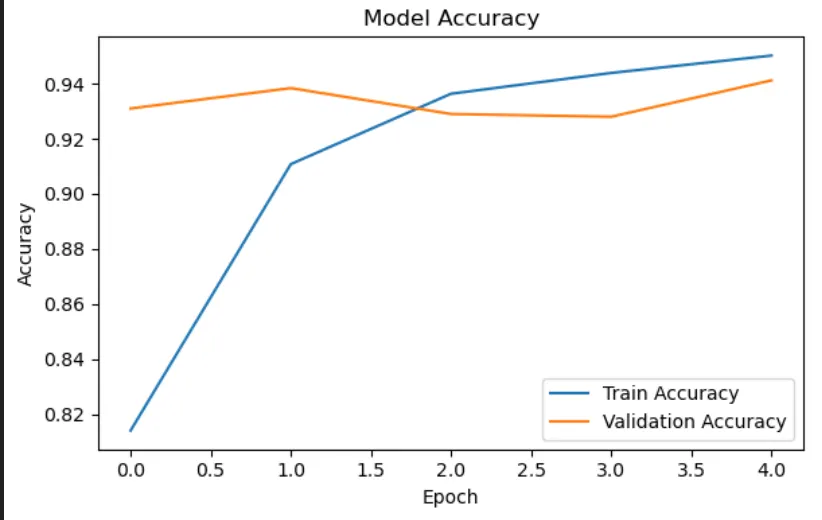
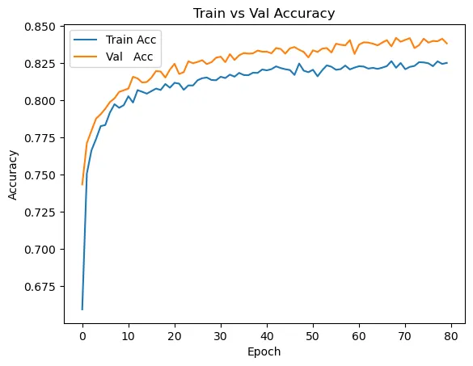
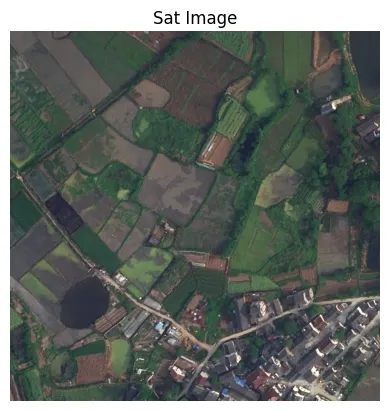
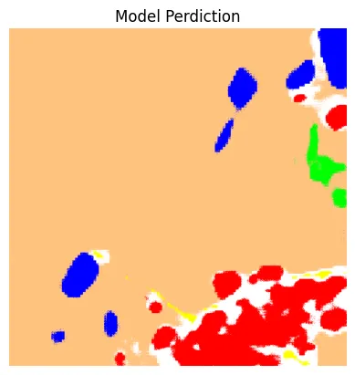

# Geospatial Machine Learning for Satellite Imagery

I dedicated part of my coursework in Dan Shiffman’s **Machine Learning for Creative Coding** to exploring different applications of machine learning on geospatial data, particularly satellite imagery.  
The code in this repository includes training and fine-tuning scripts for **YOLO** models on various satellite imagery datasets, along with a pipeline that chains YOLO bounding boxes to **SAM** masks and converts them into **GeoJSON** shapes.  
This allows detection and measurement of objects at scale.

**Datasets**
Before fine-tuning on the custom dataset, the current model is trained on a total of **28,090 aerial images** from the following datasets:

- DOTAv2.0  
- xView  
- AIRS Buildings  

---

## Multispectral vs. RGB

Different satellites capture different kinds of imagery. These images often include more than the standard RGB light bands and are therefore called multispectral. Intuitively, I expected that using multispectral data instead of RGB would improve classification accuracy.

To test this, I compared the performance of two models — a **VGG16 CNN** and a **ConvMixer** hybrid CNN/Transformer — on the **EuroSAT** dataset, which is available in both RGB and multispectral versions.  

The VGG16 model was trained on the RGB dataset, and the ConvMixer on the multispectral one.  

[Full GitHub Repository](https://github.com/DeanIA/dl4m_final)

After running a transfer learning loop for both, my intuition proved wrong:  
the RGB-trained model outperformed the multispectral model, achieving **94% vs. 84% accuracy**.

  
*Figure 1: VGG16 model results*

*Figure 2: Convmixer model results*

---

## SESSRS

Next, I started exploring ways to segment satellite imagery and came across a promising approach developed by academic researchers at the **Aerospace Information Research Institute, Chinese Academy of Sciences**, called **SESSRS**.  

The problem they were trying to solve was that semantic segmentation models can classify pixels but often blur object edges, while non-semantic models like **SAM** generate sharp boundaries but can’t assign categories.  

Their method runs the same dataset through both types of models.  
The semantic model provides labeled masks, and SAM provides precise shapes.  
By comparing the two and merging overlapping regions, they produce sharper masks that still carry class information — **without retraining either model**.  

This taught me a lot, and although it only improved agricultural mask accuracy from **65% to 75%**, it inspired the workflow that eventually worked (mentioned above).

*Figure 3: SESSRS Original Sat Image*

*Figure 4: SESSRS Model Prediction*
